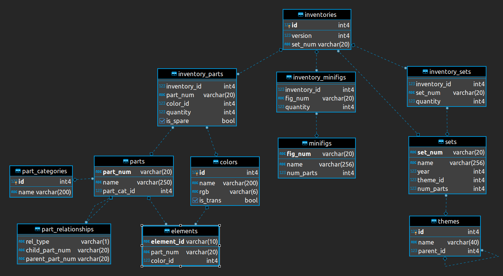
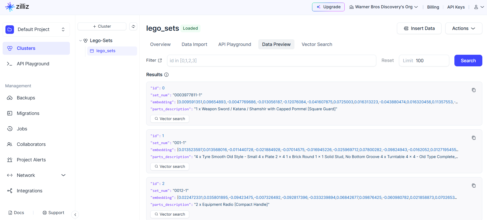

# Brickspiration
**Endless LEGO Creations**
### Challenge:
Repurpose LEGO sets for different builds
### Goal:
Develop an AI system to suggest creative and compatible alternative builds from existing LEGO sets.

# Dataset
Rebrickables

The LEGO Parts/Sets/Colors and Inventories of every official LEGO set in the Rebrickable databas as csv files.
https://rebrickable.com/downloads/
## Schema

# Pre-processing
Form the dataset by running **Depth First Search** on the dataframes built from the CSVs
For each lego set, build a combined string of part descriptions

# Embedding Vectors
Generate embeddings for the set and part description strings using Sentence Transformers
['all-MiniLM-L6-v2'](https://huggingface.co/sentence-transformers/all-MiniLM-L6-v2) model was used to generate the vector embeddings
A Milvus collection was created for the LEGO data and loaded into to a Zilliz cluster

# Vector Similarity Search on Milvus 
Retrieve the part description for the LEGO set number and create an embedding query to do similarity search on Milvus DB

